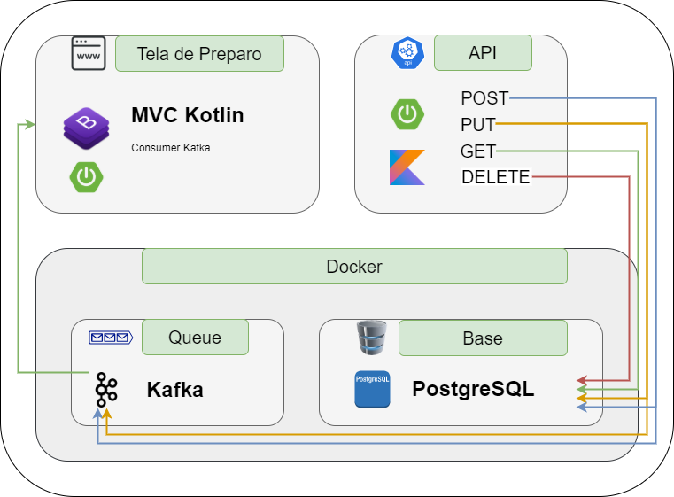
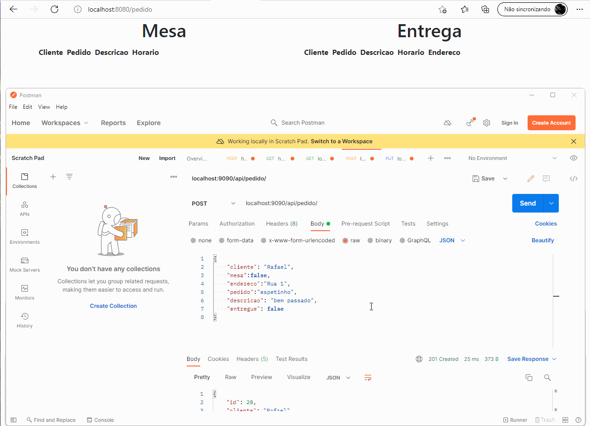

# API Restaurante

### A Ideia do projeto é implementar uma API Spring Boot Kotlin persistindo os dados em um banco Postgre e replicar as mensagens via Kafka para uma tela MVC Spring Boot

### Implementação simples, apenas para adquirir conhecimento do Kafka

### Diagrama:

### Funcionamento:

### Executando o projeto:
- docker-compose -f api-pedidos-resources.yaml up -d
- Conectar ao Docker Kafka: docker exec -it docker_kafka-1_1 bash
- Criar o Tópico: kafka-topics.sh --create --topic lista_preparacao --bootstrap-server localhost:9092 --replication-factor 2 --partitions 2

### Adicionais:
A Pasta UTILS contem o FrontEnd e o Docker Script

